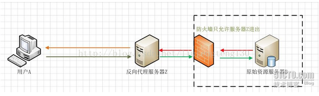
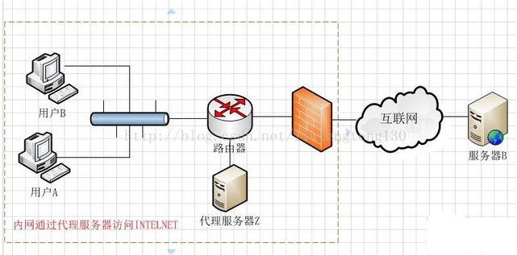
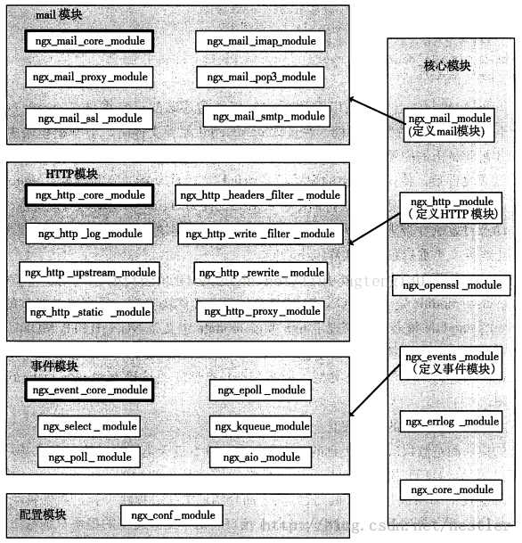
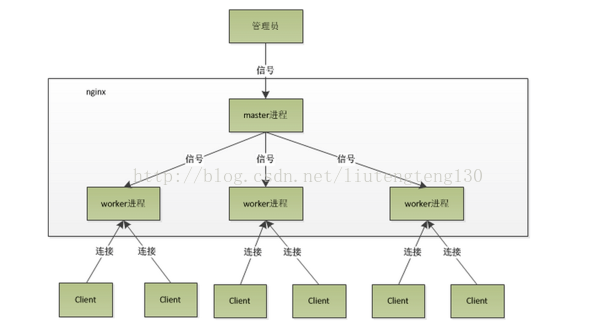
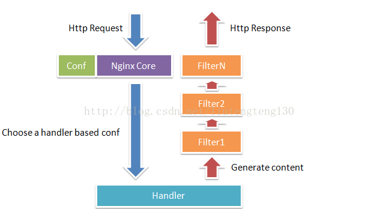
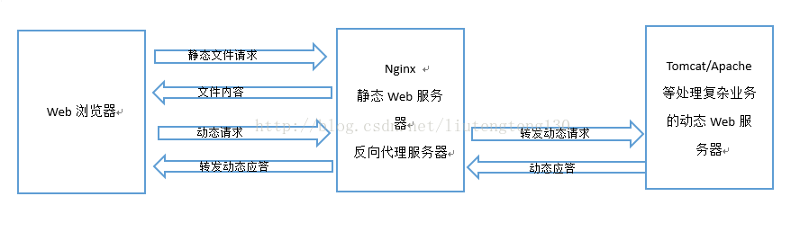
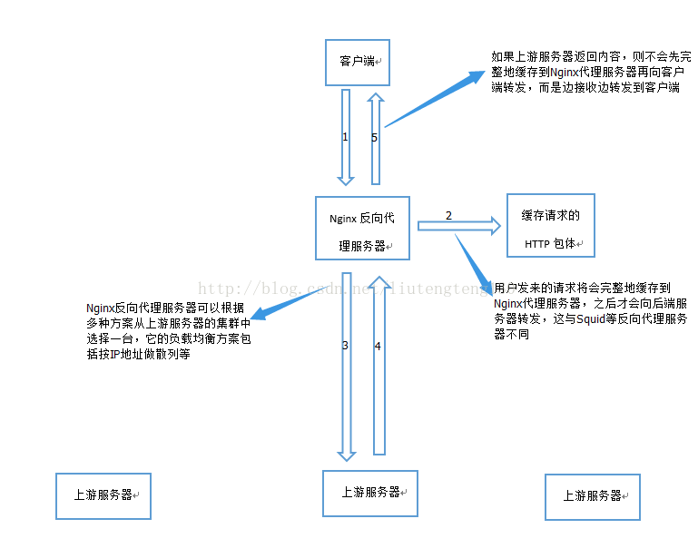

[TOC]


## 一、Nginx是什么？

### 1.介绍

Nginx是一个高性能的HTTP和反向代理服务器，也是一个IMAP/POP3/SMTP代理服务器。

Nginx是一款轻量级的Web服务器/反向代理服务器以及电子邮件代理服务器，并在一个BSD-like协议下发行。由俄罗斯的程序设计师lgor Sysoev所开发，供俄国大型的入口网站及搜索引擎Rambler使用。其特点是占有内存少，并发能力强，事实上nginx的并发能力确实在同类型的网页服务器中表现较好。

Nginx相较于Apache\lighttpd具有占有内存少，稳定性高等优势，并且依靠并发能力强，丰富的模块库以及友好灵活的配置而闻名。在Linux操作系统下，nginx使用epoll事件模型,得益于此，nginx在Linux操作系统下效率相当高。同时Nginx在OpenBSD或FreeBSD操作系统上采用类似于Epoll的高效事件模型kqueue.

### 2.名词解释

#### ①代理服务器

一般是指局域网内部的机器通过代理服务器发送请求到互联网上的服务器，代理服务器一般作用在客户端。

#### ②反向代理

客户端（用户A）向反向代理的命名空间（name-space）中的内容发送普通请求，接着反向代理将判断向何处（原始服务器）转交请求，并将获得的内容返回给客户端。而客户端始终任务它访问的事原始服务器B而不是服务器Z。由于防火墙作用，只允许服务器Z进出，防火墙和反向代理共同作用保护了院子资源服务器B。



用途：将防火墙后面的服务器提供给Internet用户访问。反向代理还可以为后端的多台服务器提供负载平衡或为后端较慢的服务器提供缓冲服务。

#### ③正向代理

正向代理是一个位于客户端A和原始服务器（服务器B）之间的服务器（代理服务器Z），为了从原始服务器取得内容，用户A向代理服务器Z发送一个请求并指定目标（服务器B），然后代理服务器Z向服务器B转交请求并将获得的内容返回给客户端。客户端必须要进行一些特别的设置才能使用正向代理。



用途：在防火墙内的局域网客户端提供访问Internet的途径。还可以使用缓冲特性减少网络使用率。

从安全性来讲：

> 正向代理允许客户端通过它访问任意网站并且隐藏客户端自身，因此你必须采取安全措施以确保仅为经过授权的客户端提供服务。反向代理对外都是透明的，访问者并不知道自己访问的是一个代理。

### 3.Nginx VS Apache

相同点：

1、都是HTTP服务器软件

2、功能上都采用模块化结构设计

3、都支持通用的语言接口，如PHP、Perl、Python等

4、支持正向、反向代理、虚拟主机、URL重写、压缩传输、SSL加密传输

不同点：

1、Apache处理速度很慢，占用很多内存资源

2、功能上，Apache所有模块支持动静态编译，Nginx模块都是静态编译的

3、对Fcgi的支持：Apache支持的很不好，Nginx支持非常好

4、处理连接方式：Nginx支持epoll,Apache不支持

5、空间使用上：Nginx安装包仅几百K

### 4.Nginx优势

1、作为Web服务器，Nginx处理静态文件、索引文件，自动索引的效率非常高

2、作为代理服务器，Nginx可以实现无缓存的反向代理加速，提高网站运行速度

3、作为负载均衡服务器，Nginx既可以在内部直接支持Rails和PHP，也可以支持HTTP代理服务器对外进行服务，同时还支持简单的容错和利用[算法](http://lib.csdn.net/base/datastructure)进行负载均衡

4、在性能方面，Nginx是专门为性能优化而开发的，实现上非常注重效率。它采用内核Poll模型，可以支持更多的并发连接，最大可以支持对5万个并发连接数的响应，而且只占用很低的内存资源

5、在稳定性方面，Nginx采取了分阶段资源分配技术，使得CPU与内存的占用率非常低。Nginx官方表示，Nginx保持1万个没有活动的连接，而这些连接只占用2.5MB内存，因此，类似DOS这样的攻击对Nginx来说基本上是没有任何作用的

6、在高可用性方面，Nginx支持热部署，启动速度特别迅速，因此可以在不间断服务的情况下，对软件版本或者配置进行升级，即使运行数月也无需重新启动，几乎可以做到7x24小时不间断地运行

Nginx具有很高的稳定性；支持热部署；代码质量非常高，代码很规范，手法成熟，模块扩展也很容易；采用了一些os提供的最新特性如对sendfile(Linux2.2+),accept-filter（FreeBSD4.1+）,TCP_DEFER_ACCEPT(Linux 2.4+)的支持，从而大大提高了性能。

## 二、模块化

高度模块化的设计设Nginx架构的基础。在Nginx中，除了少量的核心代码，其他一切皆为模块。模块化设计具有以下特点：

1、高度抽象的模块接口

2、灵活性

3、配置模块的设计使Nginx提供了高可配置性、高可扩展性、高可定制性、高可伸缩性。

4、核心模块接口简单化

5、多层次、多类别的模块设计

所有模块间是分层次、分类别的，官方Nginx有五大类型的模块：核心模块、配置模块、事件模块、HTTP模块、mail模块。

配置模块和核心模块这两种模块类型是由Nginx的框架代码所定义的，这里的配置模块是所有模块的基础，它实现了最基本的配置项解析功能（解析nginx.conf文件）。Nginx框架还会调用核心模块，但其他三种模块都不会与框架产生直接关系。事件模块、HTTP模块、mail模块这三种模块的共性是：实际上它们在核心模块中各有1个模块作为自己的代言人，并在同类模块中有1个作为核心业务与管理功能的模块。



Nginx模块直接被编译仅Nginx,因此属于静态编译方式。启动Nginx后，Nginx的模块被自动加载，不像Apache，首先将模块编译为一个so文件，然后再配置文件汇总指定是否进行加载。在解析配置文件时，Nginx的每一个模块都有可能去处理某个请求，但是同一个处理请求只能由一个模块来完成。

## 三、管理进程、多工作进程设计

Nginx由一个master进程和多个worker进程组成，但master进程或者worker进程中并不会再创建线程。



master进程

不需要处理网络事件，不负责业务的执行，只会通过管理worker等子进程来实现重启服务、平滑升级、更换日志文件、配置文件实时生效等功能。

master是通过fork系统调用子进程来实现和子进程的通信。

worker进程

>    用来处理master进程fork过来的请求
>     worker进程是通过处理信号来实现和master通信的

### 2.信号的处理过程

#### Master进程接收到信号是怎样进行处理的？

> master进程接收到信号后，会先重新加载配置文件，然后再启动新的进程，并向所有老的进程发送信号，告诉他们可以光荣退休了。新的进程在启动后，就开始接受新的请求，而老的进程在收到来自master信号后，就不再接收新的请求，并且在当前进程中的所有未处理完的请求处理完成后再退出。

Worker进程接收到信号是怎样进行处理的？

> ```SAS
>   首先，worker进程之间是平等的，每个进程，处理请求的机会也是一样的。当我们提供80端口的http服务时，一个连接请求过来，每个进程都有可能处理这个连接，怎么做到的呢？首先，每个worker进程都是从master进程fork过来的，在master进程里面，先建立好需要listen的socket之后，然后再fork出多个worker进程，这样每个worker进程都可以去接受这个socket。一般来说，当一个连接进来后，所有在accept这个socket上面的进程都会收到通知，而只有一个进程可以接受这个连接，其他的则accept失败，这就是所谓的惊群现象。
> 
>     那么为了解决这个问题，Nginx提供了一个accept\_mutex（可选项，默认打开）。这是一个加在accept上的一把共享所。有了这把锁之后，同一时刻，就会只有一个进程在accept连接,这样就不会有惊群问题了。
> 
>     当一个worker进程在accept这个连接之后，就开始读取请求，解析请求，处理请求，产生数据后，再返回给客户端，最后才断开连接。一个请求，完全由worker进程来处理，而且只在一个worker进程中处理。
> ```

### 3.这样设计的优点

#### ①利用多核系统的并发处理能力

现在[操作系统](http://lib.csdn.net/base/operatingsystem)都是多核CPU，如果一直是只有一个进程在工作，那么浪费资源，如果是worker进程间地位不平等势必造成进程瓶颈问题，Nginx为了避免这个问题，设计worker间进程平等。另外，worker数与cpu核数一致，则会达到CPU资源的充分利用，如果worker数多于cpu核数，势必造成资源的竞争；若小于cpu核数，势必造成资源浪费。提高网络性能，降低请求时延。

#### ②负载均衡

多个worker之间通过进程通信来实现负载均衡。即当一个请求到来时，更容易分配到负载较轻的worker进程中处理。这将降低请求的时延，并在一定程度上提高网络性能

#### ③管理进程负责监控工作进程的状态，并负责管理其行为

这样做的好处是：

>      a.管理进程不会占用多少系统资源
>      b.管理进程负责监控工作进程状态，如果某个工作进程死掉，管理进程负责创建出新的工作进程，避免系统性能下降。提高了系统的可靠性。

## 四、Nginx工作原理

Nginx会按需同时运行多个进程：一个主进程和几个工作进程，配置了缓存时还会有缓存加载器进程（cache loader）和缓存管理器进程（cache manager)等。所有进程均是仅含有一个线程，并主要通过“共享内存”的机制实现进程间通信。主进程以root用户身份运行，而worker、cache loader和cache manager均应以非特权用户身份运行。

### 1.Nginx模块常规的HTTP请求和响应的过程：



当它接收到一个HTTP请求时，它仅仅是通过查找配置文件将此次请求映射到一个location block,而此location中配置的各个指令则会启动不同的模块去完成工作，因此模块可以看做Nginx真正的劳动工作者。通常一个location中的指令会涉及一个handler模块和多个filter模块（当然，多个location可以服用同一个模块）。handler模块负责处理请求，完成响应内容的生成，而filter模块对响应内容进行处理。

### 2.Nginx作为Http反向代理服务器的用法：

由于Nginx具有“强悍”的高并发高负载能力，因此一般会作为前段的服务器直接向客户端提供静态文件服务。但也有一些复杂、多变的业务不适合放到Nginx服务器上，这时会用Apache、Tomcat等服务器来处理。于是，Nginx通常会被配置为既是静态Web服务器也是反向代理服务器，不适合Nginx处理的请求就会直接转发到上游服务器中处理。

Nginx作为HTTP服务器以及反向代理服务器：



Nginx作为反向代理服务器时转发请求的流程：



Nginx减轻了上游服务器的并发压力；延长了一个请求的处理时间，并增加了用于缓存请求内容的内存和磁盘空间。

### 总结：

Nginx是一个高性能的HTTP和反向代理服务器，也是一个IMAP/POP3/SMTP服务器。工作原理也很简单，通过转发请求，分担压力，从而减轻服务器的压力，达到负载均衡的效果。


    server {
        listen       80;
        server_name  pod.baidu.com;
        location / {
            proxy_pass https://www.baidu.com/;
        }
        error_page 404 /404.html;
        location = /404.html {
        }
    
        error_page 500 502 503 504 /50x.html;
        location = /50x.html {
        }
    }

