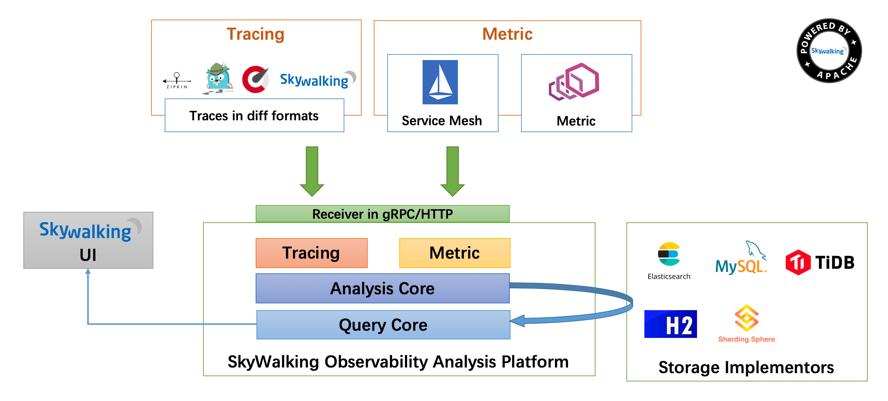

# 一、skywalking是什么？

分布式系统的应用程序性能监视工具，专为微服务、云本机架构和基于容器（Docker、K8s、Mesos）架构而设计。



### 特点

> 1.SkyWalking 是一个开源的可观测平台, 用于从服务和云原生基础设施收集, 分析, 聚合及可视化数据。
> 2.SkyWalking 是一个现代化的应用程序性能监控(Application Performance Monitoring)系统, 尤其专为云原生、基于容器的分布式系统设计.

### 组件

> 上部分Agent: 负责从应用中,收集链路信息,发给Skywalking  oap 服务器。
> 下部分Skywalking oap: 负责接收到Agent 发送的Tracing 的数据信息,然后进行分析(Analysis platform) ,存储到外部存储器最终提供query  查询功能。
> 左边Storage: Tracing数据存储，目前支持ES、MySQL、Sharding Sphere、TiDB、H2多种存储器，目前采用较多的是ES，主要考虑是SkyWalking开发团队自己的生产环境采用ES为主。
> 右边UI:负责提供控制台，查看链路等。

### 参考

### 	https://skywalking.apache.org/docs/skywalking-showcase/latest/readme/

# 二、skywalking如何安装？

[https://archive.apache.org/dist/skywalking/](https://links.jianshu.com/go?to=https%3A%2F%2Farchive.apache.org%2Fdist%2Fskywalking%2F)

1: 下载安装

2：启动agent

```shell
java -javaagent:D:\Env\project\skyworking\skywalking-agent\skywalking-agent.jar -Dskywalking.agent.service_name=service-comsumer -Dskywalking.collector.backend_service=127.0.0.1:11800  -jar service-consumer-0.0.1-SNAPSHOT.jar
```

